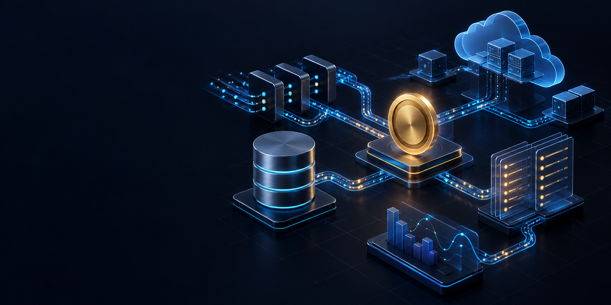
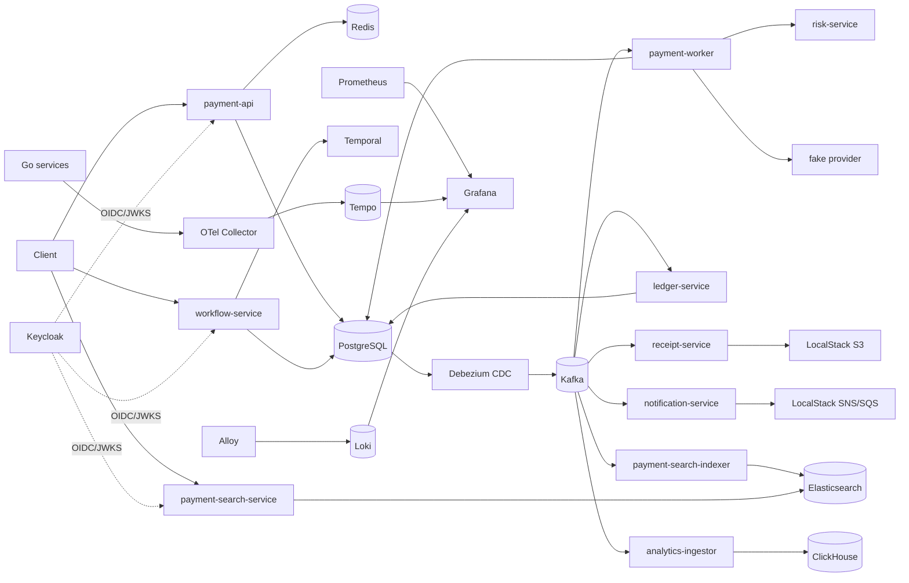

# Payment Platform

<p align="center">
  
</p>

<p align="center">
  <strong>Production-like event-driven payment platform built with Go.</strong><br>
  Reliable payments, asynchronous workflows, immutable accounting, search, analytics and observability — in one runnable local stack.
</p>

<p align="center">
  <a href="#быстрый-старт">Quick start</a> ·
  <a href="#архитектура">Architecture</a> ·
  <a href="#rest-api">API</a> ·
  <a href="#наблюдаемость">Observability</a> ·
  <a href="docs/architecture.md">Design notes</a>
</p>

> [!NOTE]
> The default configuration targets local development. A production deployment requires PCI DSS controls, organisational security practices, tested restore drills and a multi-region operating strategy.

## О проекте

**Payment Platform** — production-like платёжная платформа на Go. Это не CRUD-демо: репозиторий показывает, как связать транзакционную запись, CDC, at-least-once delivery, идемпотентность, optimistic locking, gRPC, durable workflows, поисковую и аналитическую проекции, Kubernetes, Terraform/AWS и полный локальный observability-стек.

| Что можно изучить | Как это реализовано |
| --- | --- |
| Надёжную асинхронную обработку | PostgreSQL outbox → Debezium CDC → Kafka с versioned topics и идемпотентными consumer-ами |
| Жизненный цикл платежа | Payment state machine, risk scoring по gRPC, retry/circuit breaker и cancellation |
| Учёт и возвраты | Double-entry ledger, reservation под блокировкой и Temporal workflows |
| Читающие модели | Elasticsearch search, ClickHouse analytics и S3 receipts |
| Эксплуатацию | Docker Compose, Kubernetes/Kustomize, Terraform AWS, Prometheus, Grafana, Tempo и Loki |

Подробные потоки, инварианты и ограничения описаны в [документе об архитектуре](docs/architecture.md).

## Что реализовано

| Направление | Реализация |
| --- | --- |
| Identity | Keycloak, OIDC/JWT, проверка подписи, issuer, audience, expiry и ролей |
| Search | Elasticsearch read model, асинхронный indexer и защищённый Search API |
| Deployment | Kustomize base и локальный Kubernetes overlay с probes, resources, HPA, PDB и NetworkPolicy |
| CDC | PostgreSQL logical decoding → Debezium/Kafka Connect → versioned Kafka topics |
| Durable workflows | Temporal workflows для refund и reconciliation |
| Analytics | Kafka → ClickHouse event store, current-state и daily KPI views |
| Observability | Prometheus, Grafana, OpenTelemetry Collector, Tempo, Loki и Alloy |
| Infrastructure as Code | Terraform: VPC, EKS/ECR, RDS, ElastiCache, MSK, OpenSearch, S3/SNS/SQS, IAM/IRSA, KMS, Route53/ACM и remote state |

Существующий payment flow также включает Redis cache/rate limiting, gRPC risk scoring, fake provider с retry/circuit breaker, double-entry ledger, receipts в S3 и notification delivery через SNS/SQS в LocalStack.

## Быстрый старт

Нужны Docker с Compose v2 и `make`. Go, PostgreSQL, Kafka, Keycloak и остальные зависимости устанавливать на host не требуется.

```bash
cp .env.example .env
make up
```

Первый запуск загружает крупные образы и может занять несколько минут. Compose применяет миграции, создаёт Kafka topics, регистрирует Debezium connector, импортирует Keycloak realm и инициализирует LocalStack и ClickHouse.

Проверка:

```bash
docker compose ps
curl -fsS http://localhost:8080/health
curl -fsS http://localhost:8080/ready
curl -fsS http://localhost:18086/connectors/payment-platform-outbox/status
```

Остановить контейнеры, сохранив данные:

```bash
make down
```

`make clean` удаляет контейнеры и named volumes, включая PostgreSQL, Kafka, Elasticsearch, ClickHouse, Keycloak, Temporal, Loki и Tempo. Это необратимый сброс локального стенда.

По умолчанию `.env.example` содержит `AUTH_DISABLED=true`, чтобы локальные примеры и E2E могли использовать `X-User-ID`. Защищённый режим описан ниже.

## Архитектура



### Application services

| Сервис | Ответственность |
| --- | --- |
| `payment-api` | Payments REST API, PostgreSQL-idempotency, Redis cache/rate limit, receipt command, OIDC |
| `payment-worker` | Payment state machine, risk gRPC, provider timeout/retry/circuit breaker |
| `risk-service` | Детерминированная risk policy и идемпотентное сохранение decision |
| `ledger-service` | Double-entry journals для completed payments и reversal journals для completed refunds |
| `receipt-service` | Идемпотентный receipt JSON в S3 и `receipt.created.v1` |
| `notification-service` | Durable delivery row, SNS publish и SQS consumption |
| `workflow-service` | HTTP API и Temporal worker для refunds и reconciliation |
| `payment-search-indexer` | Проекция payment lifecycle events в Elasticsearch |
| `payment-search-service` | User-scoped/full-text/filter Search API поверх Elasticsearch |
| `analytics-ingestor` | Неизменяемые payment lifecycle events в ClickHouse |
| `outbox-relay` | Legacy polling publisher; выключен по умолчанию и доступен только в Compose profile `legacy-relay` |

У каждого Go-сервиса есть `/health`, `/ready` и `/metrics`; у фоновых сервисов эти endpoints доступны только внутри Compose network, если host-порт не опубликован.

## Порты локального стенда

| Компонент | Host address |
| --- | --- |
| Payment API | `http://localhost:8080` |
| Payment Worker | `http://localhost:18081` |
| Receipt Service | `http://localhost:18083` |
| Notification Service | `http://localhost:18084` |
| Workflow Service | `http://localhost:18087` |
| Payment Search Service | `http://localhost:18089` |
| Risk gRPC | `localhost:19091` |
| PostgreSQL | `localhost:15432` |
| Redis | `localhost:16379` |
| Kafka | `localhost:19092` |
| Debezium / Kafka Connect | `http://localhost:18086` |
| LocalStack | `http://localhost:4566` |
| Keycloak | `http://localhost:18080` |
| Keycloak management | `http://localhost:19090` |
| Temporal gRPC / UI | `localhost:17233` / `http://localhost:18088` |
| Elasticsearch | `http://localhost:19200` |
| ClickHouse HTTP / native | `http://localhost:18123` / `localhost:19000` |
| Prometheus | `http://localhost:9090` |
| Grafana | `http://localhost:3000` |
| Loki | `http://localhost:13100` |
| Tempo | `http://localhost:13200` |
| Alloy UI | `http://localhost:12345` |
| OTLP gRPC / HTTP | `localhost:14317` / `localhost:14318` |

Все значения можно переопределить в `.env`; полный список находится в [.env.example](.env.example).

## Аутентификация

### Упрощённый local mode

При `AUTH_DISABLED=true` API доверяют `X-User-ID`. Значение обязано быть UUID. Этот режим нужен только для локальных примеров и тестов и не является security boundary.

```bash
USER_ID=550e8400-e29b-41d4-a716-446655440000
curl -H "X-User-ID: ${USER_ID}" http://localhost:8080/api/v1/payments
```

### Keycloak/OIDC mode

Для защищённого запуска:

```bash
AUTH_DISABLED=false docker compose up --build -d --wait
```

Realm `payments` импортируется автоматически. Dev credentials:

| Пользователь | Пароль | Роли | OIDC `sub` |
| --- | --- | --- | --- |
| `dev-user` | `dev-password` | `payment-user` | `2c507d0b-e69b-4789-82f0-d48e102387a1` |
| `dev-admin` | `dev-admin-password` | `payment-user`, `payment-admin` | `d9aefed6-96ff-444c-8f70-8ccb786c0090` |

Bootstrap console administrator по умолчанию — `admin` / `admin`; это также только local credential.

Получить access token через включённый для dev direct grant:

```bash
curl -sS -X POST \
  http://localhost:18080/realms/payments/protocol/openid-connect/token \
  -H 'Content-Type: application/x-www-form-urlencoded' \
  -d 'client_id=payment-api' \
  -d 'grant_type=password' \
  -d 'username=dev-user' \
  -d 'password=dev-password'
```

Передавайте поле `access_token` как `Authorization: Bearer <token>`. `payment-api`, Search API и Workflow API проверяют JWT signature, exact issuer, audience, expiry, UUID subject и роль `payment-user`. Reconciliation требует `payment-admin`. Search обычного пользователя всегда принудительно ограничен его `sub`; admin может использовать `user_id` или выполнять unscoped query.

Production: отключите direct grant, замените realm/users/secrets, включите TLS, используйте confidential clients или Authorization Code + PKCE и храните секреты вне manifests.

## REST API

Ниже примеры для `AUTH_DISABLED=true`. В OIDC mode замените `X-User-ID` на Bearer token.

### Создать и прочитать payment

```bash
USER_ID=550e8400-e29b-41d4-a716-446655440000

curl -i -X POST http://localhost:8080/api/v1/payments \
  -H 'Content-Type: application/json' \
  -H 'Idempotency-Key: demo-payment-1' \
  -H "X-User-ID: ${USER_ID}" \
  -d '{"amount":1000,"currency":"USD","description":"Test payment"}'
```

`amount` хранится в минимальных единицах валюты: `1000 USD` означает `$10.00`. Первый запрос возвращает `201`; тот же key и body для того же пользователя — существующий payment с `200`; тот же key с другим business body — `409 IDEMPOTENCY_CONFLICT`. Ключи изолированы по `user_id`, поэтому два tenant могут безопасно использовать одинаковое значение.

```bash
PAYMENT_ID='<payment-id>'

curl -H "X-User-ID: ${USER_ID}" \
  "http://localhost:8080/api/v1/payments/${PAYMENT_ID}"
```

Обработка асинхронна: `pending → processing → completed|failed`. Отмена разрешена только из `pending`:

```bash
curl -X POST -H "X-User-ID: ${USER_ID}" \
  "http://localhost:8080/api/v1/payments/${PAYMENT_ID}/cancel"
```

### Receipt

После `completed`:

```bash
curl -i -X POST -H "X-User-ID: ${USER_ID}" \
  "http://localhost:8080/api/v1/payments/${PAYMENT_ID}/receipt"
```

Команда возвращает `202`; receipt появляется в `s3://payment-receipts/receipts/<payment-id>.json`.

### Search

Elasticsearch проекция обновляется асинхронно, поэтому сразу после mutation возможна короткая задержка.

```bash
curl -G -H "X-User-ID: ${USER_ID}" \
  'http://localhost:18089/api/v1/payment-search' \
  --data-urlencode 'q=Test' \
  --data-urlencode 'status=completed' \
  --data-urlencode 'currency=USD' \
  --data-urlencode 'amount_min=500' \
  --data-urlencode 'limit=20'
```

Доступны `q`, `user_id` для admin, comma-separated `status`, `currency`, `amount_min`, `amount_max`, RFC3339 `created_from`/`created_to`, `limit` от 1 до 100 и `cursor`. Alias `payments-read` позволяет в дальнейшем переиндексировать данные без смены API endpoint.

### Refund

Refund — отдельный aggregate. Он допустим только для принадлежащего пользователю completed payment; pending/processing/completed refunds резервируют сумму под блокировкой payment и не позволяют конкурентно вернуть больше captured amount.

```bash
curl -i -X POST \
  -H 'Content-Type: application/json' \
  -H 'Idempotency-Key: refund-demo-1' \
  -H "X-User-ID: ${USER_ID}" \
  "http://localhost:18087/api/v1/payments/${PAYMENT_ID}/refunds" \
  -d '{"amount":400}'

REFUND_ID='<refund-id>'
curl -H "X-User-ID: ${USER_ID}" \
  "http://localhost:18087/api/v1/refunds/${REFUND_ID}"
```

Temporal выполняет `pending → processing → completed|failed` с bounded retry. `refund.completed.v1` создаёт reversal journal в ledger.

### Reconciliation

В OIDC mode endpoint требует `payment-admin`; при `AUTH_DISABLED=true` dev principal получает обе роли.

```bash
curl -i -X POST -H "X-User-ID: ${USER_ID}" \
  http://localhost:18087/api/v1/reconciliation/runs

RUN_ID='<run-id>'
curl -H "X-User-ID: ${USER_ID}" \
  "http://localhost:18087/api/v1/reconciliation/runs/${RUN_ID}"
```

Repeatable-read run фиксирует отсутствующие payment/refund journals, несбалансированные journals, amount/currency/reference mismatches, orphan journals и over-refund. Он только сообщает расхождения и не исправляет финансовые данные автоматически.

## Outbox и Debezium

Business state и outbox row записываются одной PostgreSQL-транзакцией. Основной delivery path:

```text
PostgreSQL WAL → Debezium PostgreSQL connector → Outbox EventRouter → Kafka topic
```

PostgreSQL запускается с `wal_level=logical`; connector использует `pgoutput`, отдельный replication slot/publication и routing по `event_type`. Kafka key — `aggregate_id`, поэтому события aggregate сохраняют partition affinity. Модель остаётся at-least-once: consumers должны использовать inbox/unique keys/idempotent side effects.

Проверить connector:

```bash
curl -fsS http://localhost:18086/connectors/payment-platform-outbox/status
```

Polling `outbox-relay` оставлен для сравнения и recovery experiments:

```bash
docker compose stop debezium
docker compose --profile legacy-relay up -d outbox-relay
```

Не запускайте Debezium и relay одновременно: это два независимых publisher одного outbox и они намеренно создадут дополнительные duplicate events. В CDC mode поле `published_at` относится только к legacy relay и не является подтверждением Debezium delivery; для production нужна отдельная retention/cleanup policy outbox-таблицы и мониторинг replication slot lag.

## ClickHouse analytics

`analytics-ingestor` читает пять payment lifecycle topics и сохраняет одну строку на event в `payment_analytics.payment_events`. `ReplacingMergeTree` и `event_id` дают идемпотентную аналитическую проекцию; `payment_current` восстанавливает последнее состояние, `payment_daily_kpis` считает объём и approval rate.

```bash
curl -sS -u analytics:analytics \
  'http://localhost:18123/?query=SELECT%20*%20FROM%20payment_analytics.payment_daily_kpis%20FORMAT%20Pretty'
```

Готовые запросы лежат в [deployments/clickhouse/dashboard-queries.sql](deployments/clickhouse/dashboard-queries.sql). ClickHouse и Elasticsearch — rebuildable projections, не источники платёжной истины.

## Наблюдаемость

- Go services экспортируют OTLP traces; HTTP, gRPC и pgx инструментированы.
- W3C trace context сохраняется в envelope/Kafka headers и извлекается consumers.
- OTel Collector отправляет traces в Tempo, строит span metrics/service graph для Prometheus и принимает OTLP logs.
- Alloy читает Docker JSON logs и отправляет их в Loki с labels `service`, `level`, `container` и `environment`.
- Grafana автоматически получает Prometheus, Loki и Tempo datasources; переходы log → trace и trace → logs настроены.
- Prometheus scrapes все Go services и observability components.

Основные UI:

- Grafana: [http://localhost:3000](http://localhost:3000), local credentials `admin` / `admin`;
- Prometheus: [http://localhost:9090](http://localhost:9090);
- Temporal UI: [http://localhost:18088](http://localhost:18088);
- Alloy: [http://localhost:12345](http://localhost:12345).

```bash
curl http://localhost:8080/metrics
curl http://localhost:18087/ready
curl http://localhost:13100/ready
curl http://localhost:13200/ready
```

Локальные backends используют filesystem volumes и компактную local-конфигурацию. Для production нужны object storage, retention/capacity planning, HA, alert rules и доступ через authenticated ingress.

## Kubernetes

`deployments/kubernetes/base` содержит application workloads, migration Job, ConfigMap/Secret templates, ServiceAccount, resources, probes, HPA, PDB и default-deny NetworkPolicy. `overlays/local` добавляет локальные stateful dependencies, Debezium, Keycloak, Temporal, Elasticsearch, ClickHouse и observability stack.

Сначала соберите application images и migrations image с именами, указанными в manifests:

```bash
for service in payment-api payment-worker risk-service ledger-service \
  receipt-service notification-service workflow-service \
  payment-search-indexer payment-search-service analytics-ingestor; do
  docker build --build-arg SERVICE="$service" \
    -t "payment-platform/${service}:local" .
done

docker build -f deployments/kubernetes/migrations.Dockerfile \
  -t payment-platform/migrations:local .
```

Для kind/minikube загрузите images в cluster runtime. Затем используйте Make targets (переменную `KUSTOMIZE_OVERLAY` можно переопределить):

```bash
make k8s-render
make k8s-apply
kubectl -n payment-platform get pods
kubectl -n payment-platform rollout status deployment/payment-api
make k8s-delete
```

Эквивалентные команды — `kubectl kustomize`, `kubectl apply -k` и `kubectl delete -k` для `deployments/kubernetes/overlays/local`.

Local overlay — интеграционный стенд. AWS overlay рендерится из Terraform outputs, использует immutable ECR tags, ALB/ACM, External Secrets, IRSA и managed service endpoints, создаёт MSK topics и запускает Debezium outbox connector:

```bash
make terraform-fmt-check
make terraform-validate TF_ENV=dev
make terraform-plan TF_ENV=dev
make k8s-aws-validate TF_ENV=dev
```

Полный порядок bootstrap/plan/render, обязательные внешние ClickHouse/Temporal/Keycloak contracts и предупреждение о стоимости описаны в [infra/terraform/README.md](infra/terraform/README.md). `terraform apply` намеренно остаётся только явной ручной операцией после проверки plan.

## Тесты и команды

```bash
make test
make test-unit
make test-integration
make test-e2e
make lint
make proto
make build
make logs
make config
make k8s-render
make terraform-fmt-check
make terraform-validate TF_ENV=dev
```

- `make test` запускает весь обычный Go test suite в контейнере.
- `make test-integration` проверяет реальные migrations/PostgreSQL, конкурентные create/refund reservations, tenant-scoped idempotency, retry после поздних reservations, terminal transitions и optimistic lock.
- `make test-e2e` поднимает Compose и проверяет payment до ledger/receipt/notification, Debezium status, Elasticsearch projection, ClickHouse projection, refund reversal и reconciliation.
- `make k8s-render` собирает итоговый Kustomize overlay без изменения cluster.
- `make terraform-validate` и `make terraform-plan` проверяют/планируют выбранное AWS-окружение; apply автоматически не выполняется.

E2E использует `AUTH_DISABLED=true` и eventual polling с bounded timeout. Failure-path E2E, Kafka rebalance, LocalStack redrive и automated chaos остаются направлениями расширения.

## Гарантии и ограничения

- PostgreSQL unique constraints и transactions, а не Redis или process-local locks, обеспечивают business idempotency.
- Delivery через Kafka/Debezium — at-least-once; duplicate events ожидаемы.
- Ledger journal, entries и inbox claim коммитятся атомарно; debit total обязан равняться credit total.
- Refund activities идемпотентны для Temporal replay; pending workflow подхватывается background dispatcher.
- Search и analytics eventual-consistent и могут быть полностью перестроены из событий/источника истины.
- Локально application services используют одну PostgreSQL database и общие credentials; production требует разделения ownership/roles/schemas или databases.
- Локальный Kafka работает без TLS/SASL и Elasticsearch security выключен; AWS profile использует MSK TLS, VPC OpenSearch FGAC, Redis TLS и IRSA вместо static AWS keys.
- LocalStack и fake providers не воспроизводят реальные acquiring/AWS failure modes.
- Schema Registry, contract compatibility gate, automated restore drills, SLOs/runbooks, chaos/failover suites и multi-region пока не реализованы.

## Troubleshooting

```bash
docker compose ps -a
docker compose logs --tail=200 <service>
make config
```

Проверяйте зависимости снизу вверх: PostgreSQL/migrations, Kafka topics, Debezium connector, Keycloak/Temporal, Elasticsearch/ClickHouse/LocalStack, затем application services.

Если payment остаётся `pending`:

```bash
docker compose logs --tail=200 debezium payment-worker kafka
curl -fsS http://localhost:18086/connectors/payment-platform-outbox/status
```

Если Search API не видит payment, сначала убедитесь, что payment уже достиг terminal state, затем проверьте `payment-search-indexer` и Elasticsearch. Если refund не меняет `pending`, проверьте `workflow-service`, Temporal и Temporal UI. После изменения realm import или init SQL проще использовать `make clean && make up`, так как импорты и init scripts рассчитаны на новый volume.
