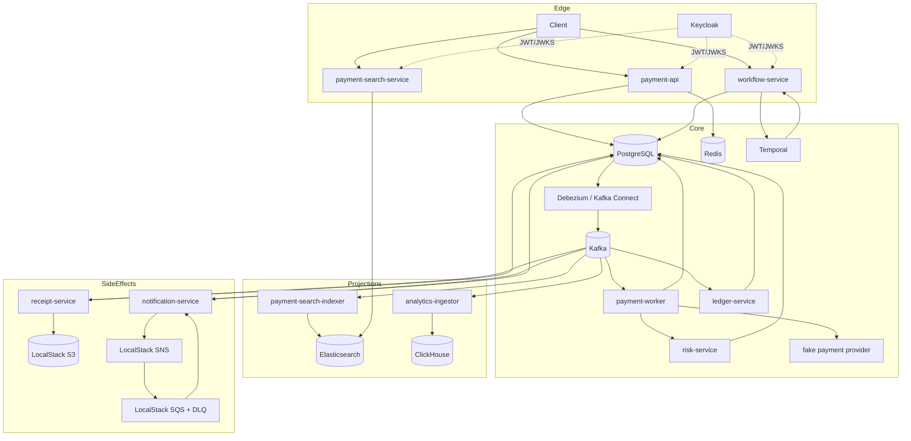
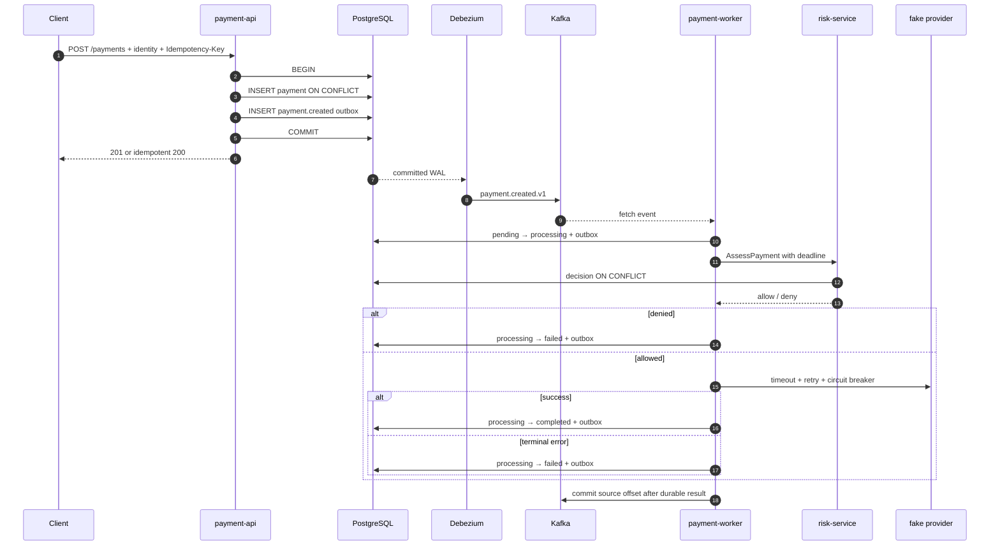
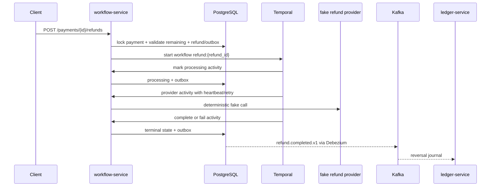

# Архитектура Payment Platform

Документ описывает фактически реализованный стенд: границы сервисов, потоки данных, гарантии и известные ограничения. Платформа сознательно не заявляет exactly-once delivery и не считает локальные credentials, single-node databases или fake providers production-решениями.

## 1. Цели и границы

Платформа объединяет несколько классов задач:

- транзакционный payment core на PostgreSQL;
- asynchronous event delivery через PostgreSQL WAL, Debezium и Kafka;
- идемпотентные at-least-once consumers и DLQ;
- OIDC authentication и role-based authorization через Keycloak;
- CQRS read model в Elasticsearch;
- durable refund/reconciliation orchestration в Temporal;
- аналитическую проекцию в ClickHouse;
- синхронный gRPC risk scoring;
- S3, SNS и SQS через LocalStack;
- metrics, traces и logs через Prometheus, Tempo, Loki, Alloy и Grafana;
- Docker Compose и Kustomize deployment models.

PostgreSQL остаётся источником business truth. Elasticsearch и ClickHouse являются eventual-consistent rebuildable projections. Kafka является журналом доставки событий, но не заменяет database constraints для финансовых инвариантов.

Вне текущей границы: реальный acquiring/refund provider, PCI DSS, chargebacks, FX, settlement, Schema Registry, фактический rollout в AWS/организационный IAM review, backup/PITR restore drills, multi-region и автоматический remediation reconciliation issues.

## 2. Security boundary

### 2.1 OIDC mode

`payment-api`, `payment-search-service` и `workflow-service` используют общий verifier:

- JWT signature проверяется по Keycloak JWKS;
- `iss` обязан точно совпасть с `AUTH_ISSUER_URL`;
- `aud` обязан содержать `AUTH_AUDIENCE`;
- библиотека проверяет срок действия token;
- `sub` обязан быть UUID и становится `user_id`;
- роли объединяются из `realm_access.roles` и `resource_access[client].roles`;
- обычно требуется `payment-user`, reconciliation дополнительно требует `payment-admin`.

В Compose issuer является внешним `http://localhost:18080/realms/payments`, а JWKS читается сервисами по внутреннему адресу Keycloak. Это позволяет валидировать token с тем же issuer, который видит локальный клиент, без обращения контейнера к host loopback.

Health, readiness и metrics endpoints не требуют access token. Business endpoints требуют Bearer token, когда `AUTH_DISABLED=false`.

### 2.2 Development bypass

`.env.example` использует `AUTH_DISABLED=true`: API доверяют UUID из `X-User-ID`. Workflow dev principal получает роли user/admin, чтобы E2E мог вызвать reconciliation. Этот режим не является аутентификацией и не должен попадать в shared или production environment.

Realm import содержит public client с direct access grant и известные пароли. Они нужны только локальному стенду. Production требует другого realm lifecycle, TLS, secret manager, rotation и подходящего OAuth flow.

### 2.3 Ownership enforcement

Payment repositories читают и меняют данные в контексте authenticated user. Refund можно создать только для completed payment того же пользователя. Search API для обычного пользователя перезаписывает любой query `user_id` значением из token subject; только `payment-admin` может выполнять unscoped/cross-user поиск.

## 3. Компоненты и durable state

| Компонент | Вход | Выход | Durable state |
| --- | --- | --- | --- |
| `payment-api` | REST | payment/receipt transaction | `payments`, `receipt_requests`, `outbox_events` |
| Debezium | PostgreSQL WAL | Kafka topics | replication slot, Kafka Connect offsets/status/config |
| `payment-worker` | `payment.created.v1` | risk gRPC, provider, transitions/outbox | `payments`, `risk_decisions`, `outbox_events` |
| `risk-service` | gRPC | allow/deny | `risk_decisions` |
| `ledger-service` | payment/refund completed events | balanced journal | `consumer_inbox`, `ledger_journals`, `ledger_entries` |
| `receipt-service` | `receipt.requested.v1` | S3 object, created event | `consumer_inbox`, `receipts`, `outbox_events` |
| `notification-service` | payment completed, SQS | SNS publish, send record | `consumer_inbox`, `notification_deliveries`, `notification_sends` |
| `workflow-service` | REST, Temporal tasks | refund/reconciliation transitions | `refunds`, `reconciliation_runs`, `reconciliation_issues`, `outbox_events` |
| `payment-search-indexer` | payment lifecycle topics | Elasticsearch document | `payments-read-v1` / `payments-read` alias |
| `payment-search-service` | REST | Elasticsearch query | no local durable state |
| `analytics-ingestor` | payment lifecycle topics | ClickHouse rows | `payment_analytics.payment_events` |
| `outbox-relay` | PostgreSQL polling | Kafka topics | `outbox_events.published_at`; legacy profile only |

Application services локально делят одну PostgreSQL database. Табличное ownership поддерживается кодом и repository boundaries, а не отдельными credentials/schemas. Это снижает стоимость локальной разработки, но не даёт полноценной blast-radius isolation.

## 4. Контекстная диаграмма



## 5. Event contracts и CDC

### 5.1 Envelope

Outbox payload и Kafka value содержат versioned JSON envelope:

```json
{
  "event_id": "uuid",
  "event_type": "payment.completed.v1",
  "version": 1,
  "occurred_at": "RFC3339 timestamp",
  "correlation_id": "request-id",
  "causation_id": "previous-event-id",
  "trace_context": {"traceparent": "00-..."},
  "payload": {}
}
```

`event_id` — ключ consumer inbox/deduplication. `aggregate_id` хранится в outbox отдельно и становится Kafka key. `correlation_id` и W3C trace context обеспечивают сквозную корреляцию HTTP → PostgreSQL → Kafka → consumer. Суффикс `.v1` и поле `version` являются частью compatibility contract; Schema Registry пока нет.

### 5.2 Topics

| Topic | Producer | Основные consumers |
| --- | --- | --- |
| `payment.created.v1` | payment transaction | worker, search indexer, analytics |
| `payment.processing.v1` | worker transition | search indexer, analytics |
| `payment.completed.v1` | worker transition | ledger, notification, search indexer, analytics |
| `payment.failed.v1` | worker transition | search indexer, analytics |
| `payment.cancelled.v1` | API transition | search indexer, analytics |
| `receipt.requested.v1` | API receipt transaction | receipt service |
| `receipt.created.v1` | receipt transaction | пока только audit/event stream |
| `refund.requested.v1` | refund transaction | audit/event stream; выполнение запускает Temporal напрямую |
| `refund.processing.v1` | Temporal activity | audit/event stream |
| `refund.completed.v1` | Temporal activity | ledger |
| `refund.failed.v1` | Temporal activity | audit/event stream |

`notification.requested.v1` и `ledger.posted.v1` зарезервированы, но текущий flow их не публикует. Compose также создаёт `<topic>.dlq`, heartbeat и три compacted Kafka Connect topics.

### 5.3 Debezium delivery path

PostgreSQL запускается с logical WAL, replication slots и WAL senders. Debezium PostgreSQL connector использует `pgoutput`, filtered publication для `public.outbox_events`, snapshot on first start и Outbox EventRouter:

```text
business row + outbox row / one COMMIT
  → WAL
  → Debezium connector
  → route topic by event_type
  → Kafka key = aggregate_id
  → JSON envelope value
```

Это устраняет application polling из основного path, но не превращает систему в exactly-once. Возможны replay после connector offset recovery, snapshot/reconfiguration или downstream offset loss. Consumers обязаны быть идемпотентными.

Debezium не меняет `outbox_events.published_at`; это поле принадлежит legacy relay. Следовательно, CDC deployment должен иметь retention/cleanup process для старых outbox rows и monitoring replication slot/WAL growth. Локальный стенд намеренно оставляет cleanup операционной задачей.

### 5.4 Legacy polling relay

`outbox-relay` доступен только в Compose profile `legacy-relay`. Он выбирает строки через `FOR UPDATE SKIP LOCKED`, публикует synchronously и затем ставит `published_at`. Падение после Kafka ack, но до PostgreSQL update создаёт duplicate.

Debezium и relay нельзя запускать одновременно: оба публикуют одну и ту же логическую строку независимо. Legacy реализация сохранена как reference implementation и recovery tool, а не как active-active publisher.

## 6. Payment flow



### 6.1 Create idempotency

API вычисляет SHA-256 канонического business request и сохраняет его рядом с `Idempotency-Key`. `UNIQUE(idempotency_key)` выбирает победителя между процессами. Проигравший запрос читает существующую строку: тот же hash возвращает payment, другой hash — conflict. Redis не участвует в этом решении.

### 6.2 State machine и optimistic locking

Payment допускает:

```text
pending → processing → completed
                     ↘ failed
pending → cancelled
```

Update содержит ожидаемую `version`; zero affected rows означает concurrent modification. Provider call выполняется вне SQL transaction/row lock. Таким образом, медленная сеть не удерживает payment row, а конкуренция worker/cancel разрешается коротким conditional update.

### 6.3 Risk и provider resilience

Risk decision уникален для `(payment_id, rules_version)`. Повторный RPC получает уже сохранённый ответ. gRPC переносит request ID и bounded deadline.

Fake payment provider поддерживает `success`, `fail`, `slow` и детерминированный `by_payment_id`. Вызов ограничен timeout, exponential retry и circuit breaker со состояниями closed/open/half-open. Mutex защищает только короткие in-memory transitions breaker/counters, но не внешний I/O.

### 6.4 Redis cache и rate limit

Payment read path использует cache-aside: при miss/ошибке читает PostgreSQL, затем кладёт значение с коротким TTL; mutations инвалидируют cache. PostgreSQL остаётся source of truth, а ownership повторно проверяется по `user_id`.

Sliding-window limiter выполняется атомарным Lua script и ограничивает API до 100 запросов в минуту на authenticated subject. При отказе Redis limiter работает fail-open, чтобы защитная оптимизация не останавливала финансовый core; при этом readiness честно сообщает dependency failure. Для public production API fail-open/fail-closed policy должна выбираться отдельно по endpoint и risk profile.

## 7. Consumer semantics и side effects

### 7.1 Общий consumer

Shared Kafka consumer запускает bounded number group members; каждый обрабатывает одну запись за раз. Handler имеет конечное число попыток с exponential backoff. После исчерпания запись сначала публикуется в `<topic>.dlq`, и лишь затем source offset commit-ится. Если DLQ publish не подтверждён, offset не подтверждается.

Это обеспечивает backpressure и at-least-once delivery. Длительный handler занимает worker slot; бесконтрольные goroutines не создаются.

### 7.2 Ledger specialization

Ledger использует отдельные consumer groups для `payment.completed.v1` и `refund.completed.v1`. Partition отображается в стабильную bounded worker queue; более позднее сообщение partition не должно быть подтверждено раньше раннего. При processing error consumer останавливается без commit, поэтому Kafka redelivers запись после restart; ledger не использует общий DLQ path.

`consumer_inbox`, journal и entries коммитятся одной transaction. Payment journal:

```text
debit  asset:provider_clearing
credit liability:merchant_payable
```

Refund reversal меняет направления:

```text
debit  liability:merchant_payable
credit asset:provider_clearing
```

Domain требует positive amount, одинаковую currency и `debit total = credit total = journal amount`. Unique `(reference_type, reference_id)` не допускает второй business journal для payment/refund.

### 7.3 Receipt

Receipt создаётся только после явной команды для completed payment. Service пишет объект по детерминированному ключу `receipts/{payment_id}.json`; replay безопасно перезаписывает тот же logical object. Inbox, metadata и `receipt.created.v1` outbox коммитятся вместе после S3 operation.

### 7.4 Notification

Payment completion атомарно превращается в durable `notification_delivery`. Отдельный polling publisher выбирает pending rows, отправляет payload в SNS; подписанная SQS queue возвращает его notification service. `notification_sends` дедуплицирует фактические отправки, SQS имеет redrive policy.

Реального email/SMS provider нет. Lock во время SNS call и простой attempt policy подходят стенду, но production implementation потребует lease, `next_attempt_at`, jitter и явной terminal policy.

## 8. Elasticsearch read model

`payment-search-indexer` независимо читает пять payment lifecycle topics. Один Elasticsearch document соответствует одному payment. Indexer использует `aggregate_version` как external version:

- duplicate с той же версией становится безопасным conflict;
- запоздавшее более старое событие не перезаписывает новое состояние;
- более новая версия обновляет document.

Index `payments-read-v1` имеет strict mapping и alias `payments-read`. Alias отделяет API от физической версии index и позволяет blue/green reindex.

Search поддерживает:

- full-text по description с дополнительными provider/failure fields;
- filters по user, одному/нескольким status, currency, amount и created time;
- stable sorting `created_at DESC, payment_id DESC`;
- `search_after` cursor вместо растущего `OFFSET`;
- limit от 1 до 100.

Read-after-write не гарантируется: PostgreSQL commit, CDC, Kafka consumption и Elasticsearch refresh образуют eventual-consistency window. Для команд и критичных ownership checks используется PostgreSQL, не search projection.

Elasticsearch security в local Compose выключен. Production требует TLS/auth, index lifecycle policy, snapshot repository, capacity/shard planning и контролируемую reindex procedure.

## 9. Temporal workflows

`workflow-service` одновременно предоставляет HTTP endpoints, запускает workflows и выполняет activities на task queue `payment-platform-workflows-v1`.

### 9.1 Refund

Refund создаётся отдельной PostgreSQL transaction с `refund.requested.v1`. Repository блокирует payment и считает сумму refunds в `pending|processing|completed`, поэтому concurrent partial refunds не могут зарезервировать больше original amount. Payment обязан принадлежать principal и иметь `completed` status.



Workflow ID детерминирован, reuse policy отклоняет duplicate start. Activities идемпотентны: terminal state не регрессирует при replay. Если HTTP успел commit-ить pending refund, но Temporal start временно недоступен, background dispatcher повторно запускает rows без `workflow_started_at`.

Provider activity имеет heartbeat, timeout и bounded retry. `REFUND_PROVIDER_MODE` управляет local fake (`success`, `fail`, `slow`, `by_refund_id`).

### 9.2 Reconciliation

Reconciliation запускается по admin API. Temporal activity в repeatable-read transaction проверяет:

- completed payment без payment ledger;
- completed refund без reversal ledger;
- journal без двух корректных debit/credit entries;
- несовпадение amount, currency или payment reference с payment/refund;
- orphan payment/refund journal;
- сумму completed refunds выше payment amount.

Run и immutable issue rows сохраняются для чтения API. Retry очищает неполный issue set внутри transaction; completed run возвращается идемпотентно. Процесс только обнаруживает и классифицирует расхождения — он не меняет payments/journals.

Это внутренняя consistency reconciliation, а не сравнение с реальным acquiring settlement file: fake provider не предоставляет внешний snapshot. Scheduler также не настроен; run создаётся on demand.

### 9.3 Temporal operational boundary

Temporal хранит durable workflow history, но business state остаётся в PostgreSQL. Workflow code не выполняет I/O; I/O находится в replay-safe activities. Local Temporal/PostgreSQL singletons и UI не заменяют production Temporal Cloud/HA cluster, namespace policy, archival и visibility retention.

## 10. ClickHouse analytics

`analytics-ingestor` читает payment lifecycle topics отдельными consumer groups и сохраняет event metadata, business payload и Kafka coordinates в `payment_analytics.payment_events`.

Таблица использует:

- `ReplacingMergeTree(ingested_at)`;
- partition по месяцу `occurred_at`;
- order key `event_id`;
- insert deduplication token = `event_id`;
- TTL 730 дней в local schema.

`payment_current` детерминированно выбирает последнюю aggregate version. `payment_daily_kpis` вычисляет created/completed/failed/cancelled counts, completed volume в minor units и approval rate. Готовые operational/product queries включают ingestion lag quantiles и failure reasons.

ClickHouse projection предназначена для аналитики, а не для payment authorization или balance calculation. ReplacingMergeTree merge асинхронен; запросы, которым нужна немедленная дедупликация, должны учитывать `FINAL`/materialized aggregate design и его стоимость.

## 11. Observability

### 11.1 Metrics

Каждый Go service предоставляет `/metrics`; Prometheus scrapes application services, OTel Collector, Loki, Tempo и Alloy внутри Compose network. Метрики включают HTTP requests, Kafka processing/errors, provider latency/outcomes и service-specific counters. Health endpoint показывает жизнь процесса, readiness проверяет критичные dependencies.

### 11.2 Traces

Go services инициализируют OpenTelemetry SDK и отправляют OTLP в Collector. HTTP, gRPC и pgx инструментированы. Trace context инжектируется в event envelope/Kafka headers и извлекается consumers.

Collector:

- отправляет traces в Tempo;
- создаёт span metrics и service graph metrics для Prometheus;
- принимает OTLP metrics/logs;
- сохраняет debug exporter для локальной диагностики.

Kafka и AWS SDK paths не имеют полного набора explicit producer/consumer/client spans, поэтому trace coverage там менее подробен, чем для HTTP/gRPC/pgx.

### 11.3 Logs

Go services пишут structured JSON. Alloy обнаруживает долгоживущие Docker containers проекта, исключает переиспользуемые one-shot init/test jobs, разбирает поля `level`, `service`, `request_id`, `trace_id` и отправляет streams в Loki. Grafana provisioned datasources связывают logs с Tempo trace ID и traces обратно с Loki.

Compose хранит Loki/Tempo/Prometheus/Grafana state в local named volumes. Production требует distributed/object storage configuration, retention/capacity limits, HA, authentication и alert routing.

## 12. Kubernetes model

`deployments/kubernetes/base` описывает application plane:

- namespace и ServiceAccount без автоматического token mount;
- ConfigMap и Secret template;
- database migration Job с Argo CD PreSync annotations;
- Deployments/Services с readiness, liveness и startup probes;
- CPU/memory requests и limits;
- HPA для API, risk, search и workflow services;
- PDB для application deployments;
- default-deny NetworkPolicy, DNS, same-namespace traffic и ingress rules для public APIs.

Base не разворачивает databases/brokers и предназначен для подключения platform dependencies через configuration/secrets.

`overlays/local` добавляет PostgreSQL, Redis, Kafka, LocalStack, Debezium, Keycloak, Temporal, Elasticsearch, ClickHouse и observability stack. Реплики/HPA уменьшены для developer cluster. Local dependencies используют development credentials и local storage semantics.

`overlays/aws` является шаблоном production application plane. Renderer связывает Terraform outputs с immutable ECR images, managed endpoints, ALB/ACM, External Secrets и workload-specific IRSA roles. Base Secret с dev credentials удаляется и заменяется четырьмя секретами с минимальной областью раскрытия; Reloader перезапускает только их потребителей после ротации. Argo CD sync waves создают namespace и секреты до blocking Sync hooks миграции и инициализации Kafka. Debezium публикует outbox через MSK TLS. VPC CNI network policy включается Terraform; внутренние managed-service порты ограничены CIDR VPC, IMDS заблокирован, а внешние provider CIDR следует дополнительно сузить, когда они стабильны.

`infra/terraform` реализует отдельный infrastructure plane: encrypted/versioned S3 remote state с native lockfile, multi-AZ VPC, EKS/ECR, RDS PostgreSQL с logical replication и PITR controls, Redis TLS, MSK TLS, VPC OpenSearch FGAC, S3/SNS/SQS/DLQ, KMS, IAM/IRSA и optional Route53/ACM. Dev/prod roots используют один composition module, но разные cost/availability/deletion defaults. Application rollout остаётся ответственностью Kustomize/GitOps, а `terraform apply` не автоматизирован.

ClickHouse, Temporal и Keycloak остаются provider-specific external contracts: Terraform принимает их secret ARNs, а AWS overlay требует private endpoints. Это не маскируется фиктивными AWS-managed аналогами.

## 13. Failure model

| Отказ | Наблюдаемое поведение | Механизм сохранности |
| --- | --- | --- |
| API падает до DB commit | клиент повторяет request | rollback |
| API падает после commit до response | клиент повторяет request | idempotency key + request hash |
| Debezium временно недоступен | committed outbox/WAL ждёт connector | replication slot + connector offsets |
| Connector/consumer replays event | duplicate delivery | inbox, unique keys, aggregate version |
| Kafka handler постоянно ошибается | общий consumer публикует DLQ | source commit только после DLQ ack |
| Ledger processing падает | service останавливается, offset не commit-ится | atomic inbox/journal transaction |
| Risk timeout | processing attempt заканчивается ошибкой | deadline и bounded retry |
| Payment provider медленный | timeout/retry/breaker | cancellable call, no long DB transaction |
| Redis недоступен | cache miss, limiter fail-open, readiness fail | PostgreSQL остаётся truth |
| S3 PUT завершён, DB commit нет | Kafka replay повторяет PUT | deterministic object key |
| SNS publish падает | delivery остаётся retryable | durable delivery row |
| Search/ClickHouse недоступен | projection lag, core продолжает работать | Kafka offsets/redelivery; PostgreSQL truth |
| Temporal start после refund commit падает | refund остаётся pending | background unstarted dispatcher |
| Temporal activity replay | activity вызывается повторно | deterministic workflow ID + idempotent transitions |

At-least-once означает, что duplicate — нормальная ветка, а не исключение. Exactly-once external side effects не заявляются.

## 14. Concurrency и lifecycle в Go

- `context.Context` проходит через HTTP, repositories, gRPC, Kafka handlers, AWS/provider calls; root context отменяется по `SIGINT/SIGTERM`.
- Shutdown использует отдельный bounded context, а не уже отменённый root context.
- Worker pools и channels имеют фиксированный размер и возвращают backpressure.
- Interfaces небольшие и объявлены рядом с потребителем; concrete graph собирается в `cmd/*`.
- Mutex используется только для process-local state, не как distributed lock.
- Distributed invariants обеспечивают PostgreSQL transactions/constraints/row locks, Temporal workflow IDs и Kafka consumer groups.
- Ожидаемые ошибки оборачиваются через `%w`; transport boundaries переводят их в HTTP/gRPC codes.

## 15. Health, tests и verification

Все Go application services имеют `/health`, `/ready`, `/metrics`. Payment API проверяет PostgreSQL, Redis и Kafka; workflow service — PostgreSQL/Temporal; projection services — соответствующий backend. Background services без host port всё равно доступны Prometheus и Kubernetes probes по cluster network.

Test layers:

- unit/component tests: domain state machines, auth, event validation, retry/breaker, risk, ledger, search, analytics, Temporal workflow behavior и concurrency;
- integration tests: реальные PostgreSQL migrations, конкурентные create/refund reservations, tenant-scoped idempotency, refund replay/terminal invariants и optimistic locking;
- E2E: Compose payment happy path, balanced ledger, receipt/S3, notification/SNS/SQS, Debezium connector, Elasticsearch, ClickHouse, refund reversal и reconciliation.

`make test-e2e` использует eventual polling с bounded timeout, а не fixed sleeps. Не покрыты автоматически все failure paths: Kafka rebalance, connector slot recovery, Redis outage, LocalStack redrive, Temporal failover и Kubernetes rolling disruption требуют дальнейших integration/chaos suites.

## 16. Trade-offs и production roadmap

| Решение | Выигрыш | Цена |
| --- | --- | --- |
| Одна PostgreSQL database | простой локальный запуск и прозрачные transactions | слабое service data isolation |
| Debezium outbox | нет application polling в основном path | replication slot operations и cleanup |
| JSON versioned events | легко читать и отлаживать | нет enforced schema compatibility |
| Elasticsearch projection | быстрый full-text/filter search | eventual consistency и reindex operations |
| ClickHouse event projection | дешёвая аналитика по истории | ещё одна eventual data copy |
| Temporal workflows | durable retry/history | отдельный control plane и activity idempotency |
| Keycloak local realm | реалистичная OIDC boundary | dev passwords/direct grant непригодны production |
| LocalStack | воспроизводимые AWS APIs | не моделирует IAM/network/quotas полностью |
| Kustomize local overlay | полный cluster exercise | не production stateful topology |
| Terraform AWS modules | воспроизводимая managed infrastructure, encryption, backup и IAM boundary | платные ресурсы и provider-specific operations |
| Loki/Tempo filesystem | быстрый локальный observability stack | нет HA/object storage/capacity guarantees |

Приоритеты дальнейшего hardening:

1. schema compatibility gate и contract fixtures;
2. outbox retention job, connector/slot lag alerts и recovery runbook;
3. per-service DB roles/schemas и запрет cross-service table access;
4. production OAuth clients, TLS/mTLS, secret manager и rotation;
5. регулярные backup/PITR restore drills поверх реализованной Terraform infrastructure;
6. alert rules, SLO/error budgets, capacity planning и incident runbooks;
7. external provider reconciliation files/checkpoints и отдельно авторизованный remediation;
8. failure-path E2E, rebalance/failover и controlled chaos automation.
